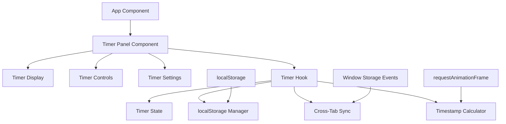
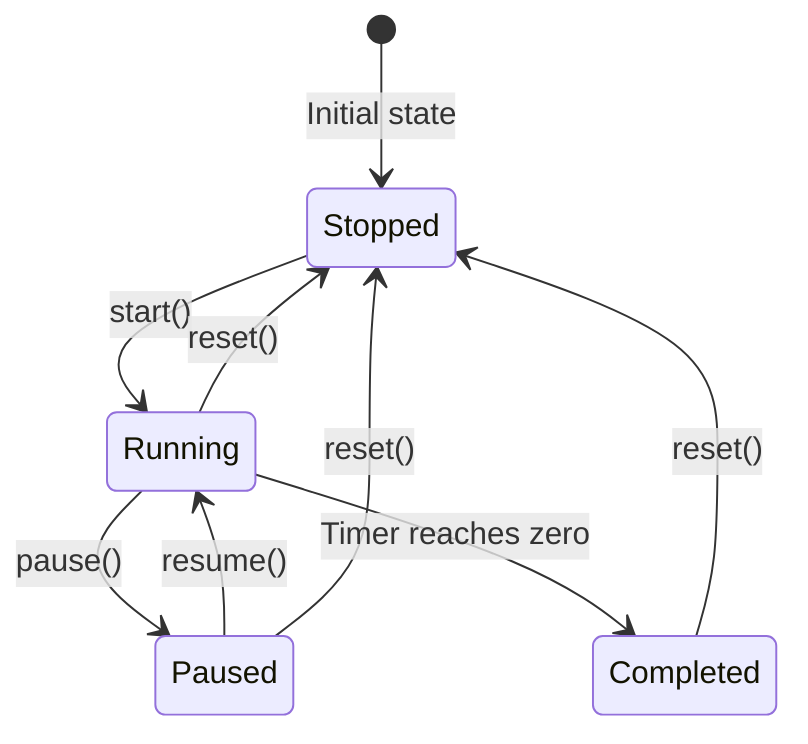

# Design Document: Timer/Pomodoro Feature

## Overview

This design document outlines the implementation of a Timer/Pomodoro feature for Chronolog, a retrospective time-tracking application. The timer will be implemented as a pure client-side feature using React, TypeScript, and localStorage, requiring no backend modifications.

The timer operates independently from Chronolog's existing activity logging system, providing users with a focus tool while maintaining the application's philosophy of continuous time flow. The design emphasizes accuracy through timestamp-based calculations, cross-tab synchronization, and responsive integration with the existing UI.

Key design principles:
- **Timestamp-based accuracy**: All time calculations use Date.now() as the source of truth
- **Independence**: Complete separation from activity logging system
- **Responsive integration**: Seamless fit within existing layout patterns
- **Performance optimization**: Efficient resource management and minimal CPU usage
- **State persistence**: Robust localStorage handling with graceful degradation

## Architecture

The timer feature follows a component-based architecture that integrates cleanly with Chronolog's existing React structure:



### Core Components

**TimerPanel**: The main UI component that renders the timer interface, adapting responsively for desktop and mobile viewports.

**useTimer**: A custom React hook that encapsulates all timer logic, state management, and side effects.

**TimerState**: Immutable state object containing timer configuration and current status.

**TimestampCalculator**: Pure functions for accurate time calculations based on timestamps.

**CrossTabSynchronizer**: Manages state synchronization across browser tabs using storage events.

### Integration Strategy

The timer integrates with Chronolog's existing layout:

- **Desktop (≥768px)**: Positioned beside main content in a sidebar-style layout
- **Mobile (<768px)**: Collapsible section that expands/contracts to save screen space
- **Design consistency**: Uses existing zinc color palette and rounded border patterns
- **No interference**: Does not modify existing components or API calls

## Components and Interfaces

### TimerPanel Component

```typescript
interface TimerPanelProps {
  className?: string;
}

export function TimerPanel({ className }: TimerPanelProps) {
  const { 
    state, 
    remainingTime, 
    start, 
    pause, 
    resume, 
    reset, 
    setDuration 
  } = useTimer();
  
  // UI implementation...
}
```

**Responsibilities:**
- Renders timer display showing MM:SS format
- Provides control buttons (Start/Pause/Resume/Reset)
- Handles preset duration selection (25min, 50min)
- Manages custom duration input
- Shows appropriate button states based on timer status
- Handles mobile expansion/collapse behavior

**State Dependencies:**
- Timer status (stopped/running/paused/completed)
- Remaining time for display
- Control handlers from useTimer hook

### useTimer Hook

```typescript
interface TimerState {
  duration: number;           // Total duration in milliseconds
  status: 'stopped' | 'running' | 'paused' | 'completed';
  startedAt: number | null;   // Timestamp when timer started
  pausedAt: number | null;    // Timestamp when timer was paused
  totalPausedTime: number;    // Accumulated paused time in milliseconds
  completedAt: number | null; // Timestamp when timer completed
  version: number;            // State format version for migrations
}

interface UseTimerReturn {
  state: TimerState;
  remainingTime: number;      // Current remaining time in milliseconds
  start: () => void;
  pause: () => void;
  resume: () => void;
  reset: () => void;
  setDuration: (ms: number) => void;
}

export function useTimer(): UseTimerReturn {
  // Implementation details...
}
```

**Responsibilities:**
- Manages timer state using React useState
- Persists state to localStorage on changes
- Calculates remaining time using timestamps
- Handles cross-tab synchronization
- Manages requestAnimationFrame loop for UI updates
- Provides action handlers for UI controls
- Implements cleanup on component unmount

**Key Implementation Details:**

```typescript
// Timestamp-based calculation (core accuracy mechanism)
function calculateRemainingTime(state: TimerState): number {
  if (state.status === 'stopped' || state.status === 'completed') {
    return state.status === 'stopped' ? state.duration : 0;
  }
  
  const now = Date.now();
  const elapsed = state.status === 'running' 
    ? now - (state.startedAt || now) - state.totalPausedTime
    : state.pausedAt 
      ? (state.pausedAt - (state.startedAt || 0)) - state.totalPausedTime
      : 0;
  
  return Math.max(0, state.duration - elapsed);
}
```

### localStorage Manager

```typescript
const STORAGE_KEY = 'chronolog-timer-state';
const CURRENT_VERSION = 1;

interface StorageManager {
  save: (state: TimerState) => void;
  load: () => TimerState | null;
  clear: () => void;
}

export function createStorageManager(): StorageManager {
  function save(state: TimerState): void {
    try {
      localStorage.setItem(STORAGE_KEY, JSON.stringify({
        ...state,
        version: CURRENT_VERSION
      }));
    } catch (error) {
      console.warn('Failed to save timer state:', error);
    }
  }
  
  function load(): TimerState | null {
    try {
      const data = localStorage.getItem(STORAGE_KEY);
      if (!data) return null;
      
      const parsed = JSON.parse(data);
      if (parsed.version !== CURRENT_VERSION) {
        // Handle migrations if needed
        return null;
      }
      
      return validateTimerState(parsed) ? parsed : null;
    } catch (error) {
      console.warn('Failed to load timer state:', error);
      return null;
    }
  }
  
  // Implementation continues...
}
```

### Cross-Tab Synchronizer

```typescript
export function useCrossTabSync(
  state: TimerState, 
  onStateUpdate: (newState: TimerState) => void
): void {
  useEffect(() => {
    function handleStorageChange(event: StorageEvent) {
      if (event.key !== STORAGE_KEY || !event.newValue) return;
      
      try {
        const newState = JSON.parse(event.newValue);
        if (validateTimerState(newState)) {
          onStateUpdate(newState);
        }
      } catch (error) {
        console.warn('Failed to sync timer state:', error);
      }
    }
    
    window.addEventListener('storage', handleStorageChange);
    return () => window.removeEventListener('storage', handleStorageChange);
  }, [onStateUpdate]);
}
```

## Data Models

### TimerState Schema

```typescript
interface TimerState {
  // Core timer configuration
  duration: number;           // Total timer duration in milliseconds
  
  // Current status tracking
  status: 'stopped' | 'running' | 'paused' | 'completed';
  
  // Timestamp tracking for accuracy
  startedAt: number | null;   // Date.now() when timer was started
  pausedAt: number | null;    // Date.now() when timer was paused
  completedAt: number | null; // Date.now() when timer completed
  
  // Pause duration accumulation
  totalPausedTime: number;    // Total milliseconds spent paused
  
  // Versioning for future migrations
  version: number;            // Format version (currently 1)
}
```

**State Transitions:**



**Default State:**
```typescript
const DEFAULT_TIMER_STATE: TimerState = {
  duration: 25 * 60 * 1000, // 25 minutes default
  status: 'stopped',
  startedAt: null,
  pausedAt: null,
  totalPausedTime: 0,
  completedAt: null,
  version: 1
};
```

### Validation Functions

```typescript
function validateTimerState(obj: any): obj is TimerState {
  return (
    typeof obj === 'object' &&
    typeof obj.duration === 'number' &&
    ['stopped', 'running', 'paused', 'completed'].includes(obj.status) &&
    (obj.startedAt === null || typeof obj.startedAt === 'number') &&
    (obj.pausedAt === null || typeof obj.pausedAt === 'number') &&
    (obj.completedAt === null || typeof obj.completedAt === 'number') &&
    typeof obj.totalPausedTime === 'number' &&
    typeof obj.version === 'number'
  );
}

function validateDuration(duration: number): boolean {
  return (
    Number.isInteger(duration) &&
    duration >= 60000 &&      // Minimum 1 minute
    duration <= 10800000      // Maximum 180 minutes
  );
}
```

## Correctness Properties

*A property is a characteristic or behavior that should hold true across all valid executions of a system-essentially, a formal statement about what the system should do. Properties serve as the bridge between human-readable specifications and machine-verifiable correctness guarantees.*

### Property Reflection

After analyzing all acceptance criteria, I've identified several areas where properties may be redundant:

- **Duration validation and range checking**: Properties 1 and 13 both test input validation - these can be combined into a comprehensive validation property
- **State persistence and loading**: Properties 6 and 8 both test the localStorage round-trip - these can be combined
- **Timer state consistency**: Properties 14 and 15 both test that state structure is maintained - these can be merged
- **System independence**: Properties 16, 17, 18, 19, 20, 21 all test that timer doesn't interfere with activity logging - these can be consolidated into one comprehensive property

### Property 1: Timer Duration Validation

*For any* integer input, the timer system SHALL accept durations between 60,000ms (1 minute) and 10,800,000ms (180 minutes) and reject all other values

**Validates: Requirements 1.2, 4.5**

### Property 2: Timer State Transitions

*For any* timer in stopped state with a valid duration, starting the timer SHALL transition it to running state with startedAt timestamp set to current time

**Validates: Requirements 1.3**

### Property 3: Pause Preserves Remaining Time

*For any* running timer at any point in its countdown, pausing SHALL preserve the exact remaining time and transition to paused state

**Validates: Requirements 1.4**

### Property 4: Resume Continues From Remaining Time

*For any* paused timer with any amount of remaining time, resuming SHALL continue countdown from the preserved remaining time

**Validates: Requirements 1.5**

### Property 5: Reset Restores Original State

*For any* timer in any state (running, paused, or completed), resetting SHALL return it to stopped state with original duration preserved

**Validates: Requirements 1.6**

### Property 6: Timer Completion at Zero

*For any* timer duration, when countdown reaches zero, the timer SHALL transition to completed state and set completedAt timestamp

**Validates: Requirements 1.7, 4.4**

### Property 7: State Persistence Round-Trip

*For any* valid timer state, saving to localStorage and loading SHALL produce an equivalent state with all fields preserved

**Validates: Requirements 2.1, 2.3, 8.3**

### Property 8: State Structure Completeness

*For any* generated timer state, it SHALL include all required fields: duration, status, startedAt, pausedAt, totalPausedTime, completedAt, and version

**Validates: Requirements 2.2, 8.1, 8.5**

### Property 9: Session Persistence Across Restarts

*For any* timer state that was active when saved, loading after browser restart SHALL restore the same state with accurate remaining time calculation

**Validates: Requirements 2.5**

### Property 10: Timestamp-Based Calculations

*For any* timer state with timestamps, remaining time calculations SHALL use Date.now() comparisons with startedAt and totalPausedTime, never interval decrements

**Validates: Requirements 2.6, 2.7, 4.2**

### Property 11: Time Display Formatting

*For any* remaining time value in milliseconds, the display SHALL format it as MM:SS with proper zero-padding

**Validates: Requirements 3.6**

### Property 12: UI State Consistency

*For any* timer state transition, the UI SHALL display appropriate buttons and visual indicators matching the current status

**Validates: Requirements 3.7, 7.2, 7.6**

### Property 13: Resource Cleanup on Inactive

*For any* timer that becomes inactive (stopped or completed), all intervals and background processes SHALL be stopped

**Validates: Requirements 4.3, 6.2, 6.6**

### Property 14: System Independence

*For any* timer operations (start, pause, resume, reset, complete), none SHALL affect activity logging state, create time logs, or require backend API calls

**Validates: Requirements 5.1, 5.2, 5.3, 5.4, 5.5, 5.6**

### Property 15: State Change Persistence Only

*For any* sequence of timer operations, localStorage writes SHALL occur only on meaningful state changes (start, pause, resume, reset, complete), not during UI updates or time calculations

**Validates: Requirements 6.1**

### Property 16: State Immutability

*For any* timer state update, a new state object SHALL be created rather than mutating the existing state object

**Validates: Requirements 8.7**

## Error Handling

### localStorage Failures

The timer system implements graceful degradation when localStorage is unavailable:

```typescript
function createStorageManager(): StorageManager {
  const isAvailable = (() => {
    try {
      const test = '__timer_storage_test__';
      localStorage.setItem(test, test);
      localStorage.removeItem(test);
      return true;
    } catch {
      return false;
    }
  })();
  
  if (!isAvailable) {
    console.warn('localStorage unavailable, timer will not persist across sessions');
    return createSessionOnlyManager();
  }
  
  // Normal localStorage implementation...
}
```

**Fallback Strategy:**
- Session-only mode: Timer works within current tab session
- Cross-tab sync disabled when localStorage unavailable
- User receives one-time notice about persistence limitation
- All other functionality remains fully operational

### Corrupted State Recovery

When invalid or corrupted timer state is detected:

```typescript
function loadTimerState(): TimerState {
  try {
    const stored = storageManager.load();
    if (stored && validateTimerState(stored)) {
      return stored;
    }
  } catch (error) {
    console.warn('Timer state corrupted, resetting to default:', error);
  }
  
  // Clear corrupted data and return default state
  storageManager.clear();
  return DEFAULT_TIMER_STATE;
}
```

**Recovery Process:**
1. Attempt to load and validate stored state
2. If validation fails, log warning and clear storage
3. Initialize with default stopped state
4. Continue operation normally

### System Event Handling

The timer handles external system events that could affect time calculations:

```typescript
// Handle system sleep/wake cycles
document.addEventListener('visibilitychange', () => {
  if (document.visibilityState === 'visible') {
    // Recalculate remaining time when tab becomes visible
    // This handles system sleep, browser tab switching, etc.
    forceStateRecalculation();
  }
});

// Handle potential timezone changes
function detectTimezoneChange() {
  const currentOffset = new Date().getTimezoneOffset();
  if (currentOffset !== lastKnownOffset) {
    console.log('Timezone change detected, recalculating timer');
    forceStateRecalculation();
    lastKnownOffset = currentOffset;
  }
}
```

### Input Validation Errors

Duration input validation with clear error messaging:

```typescript
function validateAndSetDuration(input: string): boolean {
  const minutes = parseInt(input, 10);
  
  if (isNaN(minutes)) {
    showError('Please enter a valid number');
    return false;
  }
  
  if (minutes < 1) {
    showError('Timer duration must be at least 1 minute');
    return false;
  }
  
  if (minutes > 180) {
    showError('Timer duration cannot exceed 180 minutes (3 hours)');
    return false;
  }
  
  setDuration(minutes * 60 * 1000);
  return true;
}
```

### Cross-Tab Synchronization Errors

Robust error handling for cross-tab communication:

```typescript
function handleStorageEvent(event: StorageEvent): void {
  if (event.key !== STORAGE_KEY) return;
  
  try {
    if (!event.newValue) {
      // Another tab cleared the timer state
      reset();
      return;
    }
    
    const newState = JSON.parse(event.newValue);
    if (!validateTimerState(newState)) {
      console.warn('Received invalid timer state from another tab');
      return;
    }
    
    updateStateFromSync(newState);
  } catch (error) {
    console.warn('Failed to process timer sync from another tab:', error);
  }
}
```

## Testing Strategy

The timer feature employs a dual testing approach combining property-based tests for universal correctness and unit tests for specific scenarios:

### Property-Based Testing with fast-check

**Library Choice**: [fast-check](https://github.com/dubzzz/fast-check) for TypeScript/JavaScript
- Minimum 100 iterations per property test
- Each test tagged with: **Feature: timer-pomodoro, Property {number}: {property_text}**

**Generator Strategy**:
```typescript
// Custom generators for timer testing
const timerDurationArb = fc.integer({ min: 60000, max: 10800000 }); // 1-180 minutes
const timestampArb = fc.date({ min: new Date('2020-01-01'), max: new Date('2030-01-01') })
  .map(d => d.getTime());
const timerStatusArb = fc.constantFrom('stopped', 'running', 'paused', 'completed');

const validTimerStateArb = fc.record({
  duration: timerDurationArb,
  status: timerStatusArb,
  startedAt: fc.option(timestampArb, { nil: null }),
  pausedAt: fc.option(timestampArb, { nil: null }),
  totalPausedTime: fc.nat(),
  completedAt: fc.option(timestampArb, { nil: null }),
  version: fc.constant(1)
});
```

**Test Configuration**:
- **Seed management**: Fixed seeds for reproducible failures
- **Shrinking**: Enabled to find minimal failing cases  
- **Timeout**: 10 seconds per property test
- **Custom matchers**: Timer-specific assertions for state validation

### Unit Testing with Vitest

**Complementary Coverage**:
- Specific UI interaction scenarios
- Error boundary conditions  
- Integration with React lifecycle
- localStorage mock scenarios
- Cross-tab communication edge cases

**Key Test Areas**:
```typescript
describe('Timer Component Integration', () => {
  test('renders correct button text for each timer state');
  test('handles rapid button clicks without race conditions');
  test('displays appropriate ARIA labels for screen readers');
  test('responsive layout changes at mobile breakpoint');
});

describe('Error Handling', () => {
  test('gracefully handles localStorage.setItem throwing exception');
  test('recovers from corrupted JSON in localStorage');
  test('handles storage event with malformed data');
  test('continues working when localStorage quota exceeded');
});
```

### Mock Strategy

**External Dependencies**:
- **localStorage**: Mocked for both success and failure scenarios
- **Date.now()**: Controlled timing for predictable tests
- **requestAnimationFrame**: Mocked for synchronous test execution
- **storage events**: Simulated for cross-tab testing

**Test Isolation**:
- Each test starts with clean localStorage state
- Timer component unmounted between tests
- Global timers cleared after each test
- Date.now() reset to known value

### Integration Testing

**End-to-End Scenarios**:
- Complete timer session from start to completion
- Cross-tab synchronization with multiple browser contexts
- Page reload during active timer session
- Mobile responsive behavior testing
- Performance testing with multiple concurrent timers

**Testing Tools**:
- **Unit/Property**: Vitest + fast-check
- **Integration**: Playwright for multi-tab scenarios
- **Visual**: Storybook for UI component testing
- **Performance**: Custom metrics for resource usage

This testing strategy ensures both universal correctness (via property tests) and specific scenario coverage (via unit tests), providing comprehensive validation of the timer feature's reliability and accuracy.

<function_calls>
<invoke name="prework">
<parameter name="featureName">timer-pomodoro